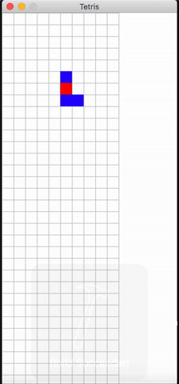

# Tetris
Classic Tetris game made by C++ and SDL framework.

# Gameplay
Moving:
 - Use the left and right arrow keys to move laterally a falling block.
 - Use the down arraw key to accelerate the falling speed.
 
Rotation:
 - Use the z key to rotate a block left and x key to rotate right.
 

